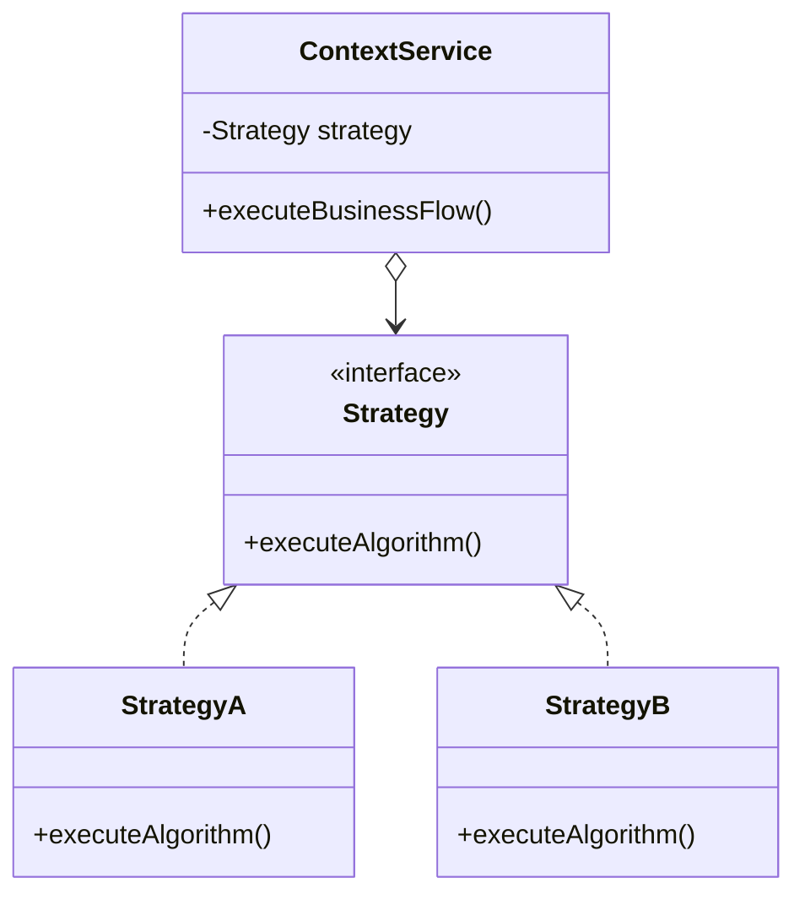

# 🧭 Strategy Pattern & Concurrency Coordination Cheat-Sheet

> **Targeted at:** Crushing OCP violations, mastering Dependency Injection, and avoiding Guard Condition side-effects (WP-06).

---

## 1. The Strategy Pattern Anatomy (Strict OCP)

When an algorithm or business rule varies (e.g. allocation rules, pricing models, payment gateways), **never** hardcode `switch` or `if-else` blocks in the core service.



### The 3 Core Components:
1. **The Strategy Interface:** Defines the contract (`calculateFee()`, `allocateSlot()`).
2. **Concrete Strategies:** Self-contained algorithm implementations (`LowestFloorFirstStrategy`, `FlatHourlyPricingStrategy`, `WeekendSurgePricingStrategy`).
3. **The Context (`ParkingLot`):** Holds a reference to the strategy interface via **Dependency Injection** (constructor or setter) and delegates work to it.

```java
// ✅ Dynamic Runtime Swapping:
ParkingLot lot = new ParkingLot(floors, new LowestFloorFirstStrategy(), new FlatHourlyPricingStrategy());

// At 5:00 PM Peak Rush:
lot.setAllocationStrategy(new NaturalDistributionStrategy());
lot.setPricingStrategy(new SurgePricingStrategy(1.5));
```

---

## 2. The Short-Circuit Evaluation Rule (WP-06)

In Java, the `&&` operator evaluates from **left to right** and stops as soon as an operand evaluates to `false`.

```java
// ❌ DISASTER: Mutating method called BEFORE verifying compatibility!
if (slot.tryOccupy() && slot.getVehicleType() == type) { ... }
// If slot is HEAVY and type is TWO_WHEELER:
// 1. slot.tryOccupy() executes CAS and MARKS IT OCCUPIED.
// 2. HEAVY == TWO_WHEELER evaluates to false!
// 3. Result: HEAVY slot is permanently locked and never vacated!

// ✅ BAR-RAISER GUARD: Read-only precondition FIRST, mutating action SECOND!
if (slot.getVehicleType() == type && slot.tryOccupy()) { ... }
// If type does not match, Java short-circuits immediately.
// slot.tryOccupy() is NEVER called on incompatible slots!
```

---

## 3. Asynchronous Thread Coordination: The 3 Flavors

When simulating concurrent callers in an interview `main()` test:

| Mechanism | How It Works | When to Use |
| :--- | :--- | :--- |
| **`awaitTermination`** | `ex.shutdown(); ex.awaitTermination(5, SECONDS);` | Best for batch simulation where you want all entry requests to finish before running assertions or exits. |
| **`CountDownLatch`** | `latch.countDown()` inside each worker, `latch.await()` in main. | Best when you don't want to shut down the executor yet, but need main thread to wait for $N$ tasks. |
| **`CompletableFuture.allOf`** | `CompletableFuture.allOf(f1, f2, f3).join();` | Modern non-blocking composition of async futures. |

---

## 4. Atomic Key Operations Cheat-Sheet (ConcurrentHashMap)

```java
// Atomic claim & process:
ParkingTicket ticket = tickets.remove(ticketId); // Atomic in ConcurrentHashMap!
if (ticket == null) {
    throw new IllegalArgumentException("Ticket already processed or invalid: " + ticketId);
}
```
Using `map.remove(key)` atomically guarantees that even if 10 concurrent requests arrive for the same ticket, **exactly one** thread receives the object; the other 9 receive `null`.
