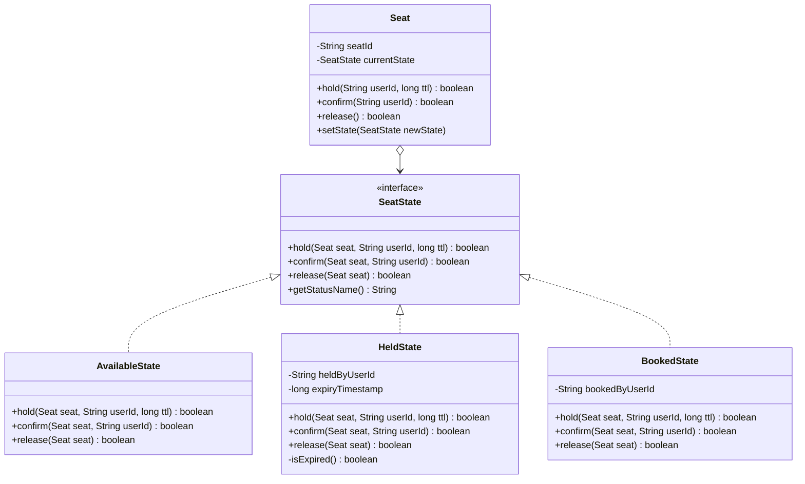

# 🎭 State Pattern Mastery: The Interview Survival Guide

> **Targeted at:** Eliminating giant `switch-case` antipatterns, mastering lifecycle state machines, and handling time-based state transitions (TTL).

---

## 1. The Core Problem: Why `enum` + `switch` Fails at Scale

Consider a naive implementation of a booking seat:
```java
// ❌ NAIVE ANTIPATTERN: The Exploding Switch-Case
public class Seat {
    private SeatStatus status; // AVAILABLE, HELD, BOOKED
    private long holdExpiryTime;
    private String heldByUserId;

    public void hold(String userId, long ttl) {
        if (status == SeatStatus.AVAILABLE) {
            this.status = SeatStatus.HELD;
            this.heldByUserId = userId;
            this.holdExpiryTime = System.currentTimeMillis() + ttl;
        } else if (status == SeatStatus.HELD) {
            if (System.currentTimeMillis() > holdExpiryTime) {
                // Expired, reclaim
                this.heldByUserId = userId;
                this.holdExpiryTime = System.currentTimeMillis() + ttl;
            } else {
                throw new IllegalStateException("Seat is held by someone else!");
            }
        } else if (status == SeatStatus.BOOKED) {
            throw new IllegalStateException("Cannot hold already booked seat!");
        }
    }
}
```

### Why Interviewers Hate This:
1. **Violation of Single Responsibility (SRP):** `Seat` is managing its own business identity AND every single transition rule for every state.
2. **Violation of Open-Closed Principle (OCP):** Adding a new state (e.g. `MAINTENANCE`, `VIP_RESERVED`, `REFUNDED`) requires modifying *every single method* in `Seat`.
3. **Cyclomatic Complexity Explosion:** As operations increase (`hold()`, `confirm()`, `cancel()`, `refund()`, `lock()`), you get an $N \times M$ matrix of brittle `if-else` conditions.

---

## 2. The State Pattern Architecture (GoF)

The **State Pattern** encapsulates each state into its own polymorphic class. The context object (`Seat`) delegates all state-dependent behavior to its current state pointer.



---

## 3. Concrete Implementation Blueprint

### Step 1: The State Contract
```java
public interface SeatState {
    boolean hold(Seat seat, String userId, long ttlMillis);
    boolean confirm(Seat seat, String userId);
    boolean release(Seat seat);
    String getStatusName();
}
```

### Step 2: The Context (`Seat`)
```java
public class Seat {
    private final String seatId;
    private SeatState state;

    public Seat(String seatId) {
        this.seatId = seatId;
        this.state = new AvailableState(); // Default initial state
    }

    // Thread-safety: synchronize on the Seat instance
    public synchronized boolean hold(String userId, long ttlMillis) {
        return state.hold(this, userId, ttlMillis);
    }

    public synchronized boolean confirm(String userId) {
        return state.confirm(this, userId);
    }

    public synchronized boolean release() {
        return state.release(this);
    }

    public synchronized void setState(SeatState newState) {
        this.state = newState;
    }

    public synchronized SeatState getState() {
        return this.state;
    }

    public String getSeatId() {
        return seatId;
    }
}
```

### Step 3: Concrete States & Transitions

#### 🟢 `AvailableState`:
```java
public class AvailableState implements SeatState {
    @Override
    public boolean hold(Seat seat, String userId, long ttlMillis) {
        long expiry = System.currentTimeMillis() + ttlMillis;
        seat.setState(new HeldState(userId, expiry));
        return true;
    }

    @Override
    public boolean confirm(Seat seat, String userId) {
        // Cannot confirm a seat that hasn't been held!
        throw new IllegalStateException("Seat " + seat.getSeatId() + " is available; cannot confirm without holding.");
    }

    @Override
    public boolean release(Seat seat) {
        return true; // Already available, no-op
    }

    @Override
    public String getStatusName() { return "AVAILABLE"; }
}
```

#### 🟡 `HeldState` (Handling TTL Timeouts):
```java
public class HeldState implements SeatState {
    private final String heldByUserId;
    private final long expiryTimestamp;

    public HeldState(String heldByUserId, long expiryTimestamp) {
        this.heldByUserId = heldByUserId;
        this.expiryTimestamp = expiryTimestamp;
    }

    private boolean isExpired() {
        return System.currentTimeMillis() > expiryTimestamp;
    }

    @Override
    public boolean hold(Seat seat, String userId, long ttlMillis) {
        if (isExpired()) {
            // Expired! Reclaim for the new user
            seat.setState(new HeldState(userId, System.currentTimeMillis() + ttlMillis));
            return true;
        }
        // Active hold by someone else
        return false;
    }

    @Override
    public boolean confirm(Seat seat, String userId) {
        if (isExpired()) {
            seat.setState(new AvailableState());
            throw new IllegalStateException("Hold has expired for seat " + seat.getSeatId());
        }
        if (!this.heldByUserId.equals(userId)) {
            throw new IllegalStateException("User " + userId + " does not hold seat " + seat.getSeatId());
        }
        // Transition to permanently booked!
        seat.setState(new BookedState(userId));
        return true;
    }

    @Override
    public boolean release(Seat seat) {
        seat.setState(new AvailableState());
        return true;
    }

    @Override
    public String getStatusName() { return "HELD"; }
}
```

#### 🔴 `BookedState` (Terminal State):
```java
public class BookedState implements SeatState {
    private final String bookedByUserId;

    public BookedState(String bookedByUserId) {
        this.bookedByUserId = bookedByUserId;
    }

    @Override
    public boolean hold(Seat seat, String userId, long ttlMillis) {
        return false; // Permanently booked, cannot hold
    }

    @Override
    public boolean confirm(Seat seat, String userId) {
        throw new IllegalStateException("Seat " + seat.getSeatId() + " is already booked.");
    }

    @Override
    public boolean release(Seat seat) {
        throw new IllegalStateException("Cannot release a permanently booked seat.");
    }

    @Override
    public String getStatusName() { return "BOOKED"; }
}
```

---

## 4. Key Differences: Strategy vs State Pattern

| Aspect | Strategy Pattern | State Pattern |
| :--- | :--- | :--- |
| **Intent** | Swap **different algorithms** for the same task (e.g. Lowest Floor vs Proximity). | Alter behavior based on **internal lifecycle status**. |
| **Awareness** | Strategies rarely know about each other or change the context's strategy pointer. | States know about other states and **actively trigger transitions** (`seat.setState(...)`). |
| **Usage** | Client usually injects the strategy at construction. | Transitions occur dynamically and automatically during execution. |

---

## 5. Classic SDE-2 Interview Problems for State Pattern:
1. **BookMyShow / Concert Ticket Booking** (Available $\rightarrow$ Held $\rightarrow$ Booked)
2. **Vending Machine** (NoCoin $\rightarrow$ HasCoin $\rightarrow$ Dispensing $\rightarrow$ SoldOut)
3. **E-Commerce Order** (Created $\rightarrow$ PaymentPending $\rightarrow$ Confirmed $\rightarrow$ Shipped $\rightarrow$ Delivered)
4. **Elevator System** (Idle $\rightarrow$ MovingUp $\rightarrow$ MovingDown $\rightarrow$ Maintenance)
