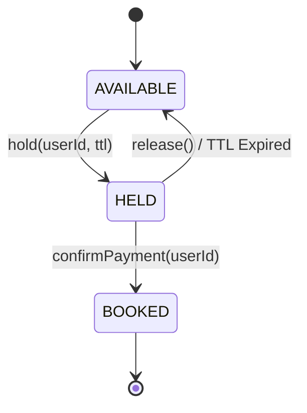

# 🎟️ Day 02: Concert & Movie Ticket Booking System (BookMyShow / TicketMaster)

> **Difficulty:** Medium-Hard (Top-Tier SDE-2 Machine Coding Staple)  
> **Time Limit:** 50 Minutes  
> **Target Pattern:** **The State Pattern** (Strict State Machine Modeling)  
> **Key Concepts:** State Transitions, Seat Lock Concurrency, Time-To-Live (TTL) Lock Expiration

---

## 🏢 Business Context
You are building the core seat reservation engine for a high-traffic ticketing platform (BookMyShow / TicketMaster). During flash sales (e.g. Coldplay concert), thousands of concurrent users vie for the same finite pool of seats.

To prevent double-booking while giving users time to complete payment, the system temporarily **holds** selected seats for a configured time window (e.g. 5 seconds for simulation / 10 minutes in real life). If payment completes in time, the hold turns into a permanent **booking**. If payment fails or times out, the seat automatically reverts to **available**.

---

## 🎭 The Design Pattern Focus: The State Pattern

In naive designs, developers create an `enum SeatStatus { AVAILABLE, HELD, BOOKED }` and write giant `switch-case` blocks full of complex `if (status == HELD && isExpired(holdTime))` checks. This quickly becomes an unmaintainable nightmare.

**In this challenge, you will implement the textbook State Pattern:**
- Each state is represented by a dedicated class implementing a common `SeatState` interface.
- State transitions are managed cleanly by the state objects.
- Invalid operations (e.g. trying to pay for an `AVAILABLE` seat or trying to hold a `BOOKED` seat) throw an explicit exception or return false, without messy conditionals.

---

## 📋 Functional Requirements (P0 - Must Have)

1. **Show & Seat Modeling:**
   - A `Show` has a unique ID, movie/event name, and a grid/list of `Seat` objects (e.g., Row A, Number 1).
   - Each `Seat` maintains its current `SeatState`.

2. **Temporary Seat Hold (`holdSeats`):**
   - A user can request to hold one or more seats for a specific `Show`.
   - If ALL requested seats are available, they are atomically transitioned to `HELD` with an expiration timestamp and assigned to the user.
   - If ANY requested seat is already held or booked, the operation fails cleanly (atomic all-or-nothing hold).

3. **Booking Confirmation (`confirmBooking`):**
   - The user submits payment for their held seats.
   - If the hold has NOT expired and belongs to the user, the seats transition to `BOOKED` and a `BookingReceipt` is issued.
   - If the hold has expired, the booking is rejected.

4. **Hold Expiration & Auto-Release (TTL Mechanism):**
   - Seats held for longer than TTL must either be lazily expired upon next access OR actively cleaned up.
   - Once expired, other users must be able to hold and book them.

---

## ⚡ Non-Functional Requirements (The Bar-Raiser Checklist)

1. **Strict State Pattern (No God Enums):**
   - `Seat` delegates behavior to `SeatState`.
   - State classes: `AvailableState`, `HeldState`, `BookedState`.
2. **Concurrency & Race Condition Prevention:**
   - Multiple threads attempting to hold the same seat simultaneously: **exactly one** must succeed.
   - Use atomic operations or appropriate synchronization around state transitions.
3. **State Invariant Protection:**
   - No double-booking under any circumstance.
   - A user cannot confirm a seat held by another user.

---

## 🚀 Starter & Deliverable

Create your solution in:  
👉 `prep/problems/day02_ticket_booking/BookingSystem.java`

Include a self-contained `public static void main(String[] args)` that demonstrates:
1. Initialize a Show with 5 seats (`A1` to `A5`).
2. User 1 successfully holds `A1` and `A2`.
3. User 2 attempts to hold `A2` and `A3` $\rightarrow$ correctly rejected because `A2` is held.
4. User 1 confirms payment for `A1` and `A2` $\rightarrow$ transitions to `BOOKED`.
5. User 3 holds `A3` with a short TTL (e.g. 2 seconds), walks away. Show that after sleep/expiration, User 4 can successfully claim `A3`.
6. **Concurrent Hold Test:** 2 threads attempt to hold the last remaining seat (`A4`) at the exact same millisecond $\rightarrow$ prove zero double-booking.
